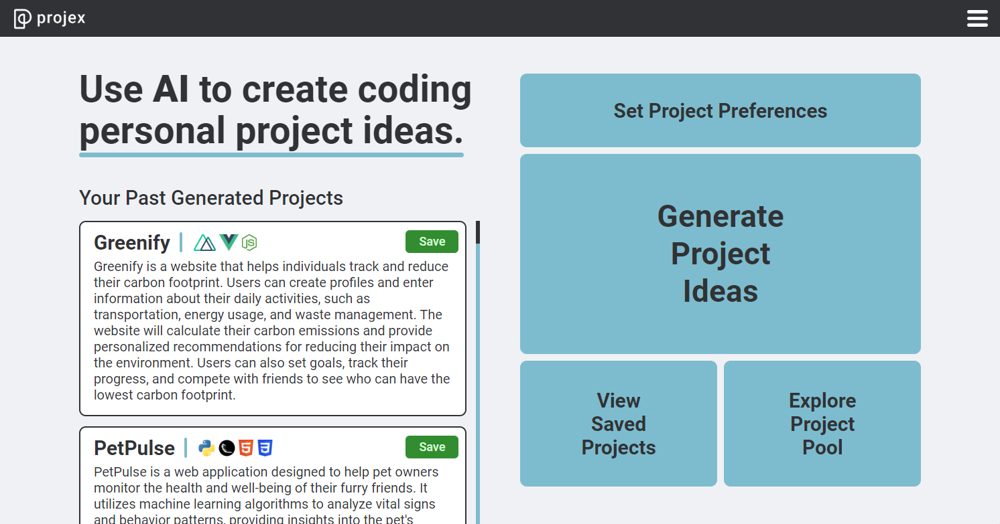
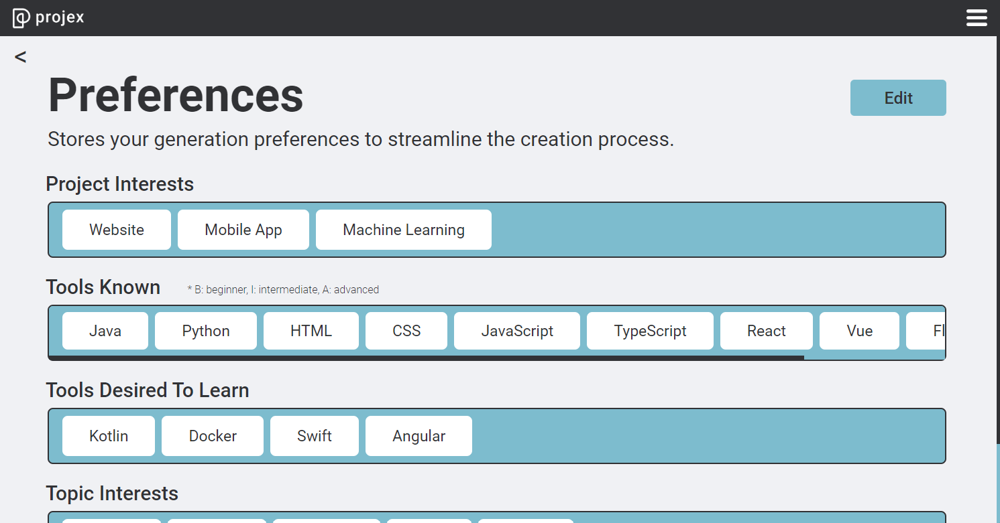
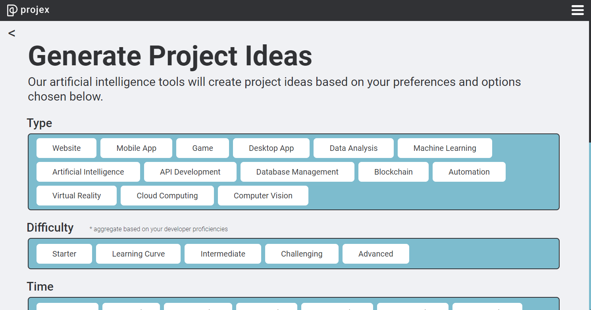
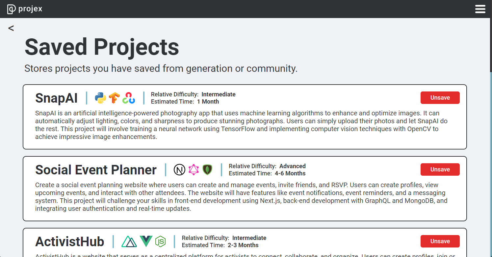

# Projex

[Live Demo](https://drive.google.com/file/d/1CuL6cXabCZVm2w33mt-Y4uQjUmN8oNns/view)&nbsp;&nbsp;|&nbsp;&nbsp;<i>Created: Winter Break 2023 (College Sophomore)</i>

 
 

 
 

 
<b>Projex is a web app that generates coding personal project ideas based on user preferences, skills, and interests.</b>
  

Some of its main sections include:
 - <strong>Dashboard</strong>, which includes some of the user's past generated projects, navigation to the main pages, and a short statement of the app's purpose
 - <strong>Project Preferences</strong>, which allows the user to store some of their coding traits for more personalized project generations
 - <strong>Generate Projects</strong>, where users select project options and the app uses the user's options and preferences to generate an extensive list of project ideas
     - Each project idea includes the title, description, coding tools used, estimated time to complete, and estimated difficulty based on user's skills
 - <strong>Project Pool</strong>, which allows for greater project discovery by storing unsaved projects generated from other users
 - <strong>Saved Projects</strong>, which stores projects that the user saves from their generations or the project pool

Additional notes:
 - The OpenAI GPT 3.5 Turbo model is used for project generation
 - Users are authenticated using Supabase Google Single Sign-On

<b>Tools used:</b>
 - TypeScript - Vue
 - Python - Django
 - HTML/CSS - Sass
 - PostgreSQL, Supabase
 - OpenAI API
